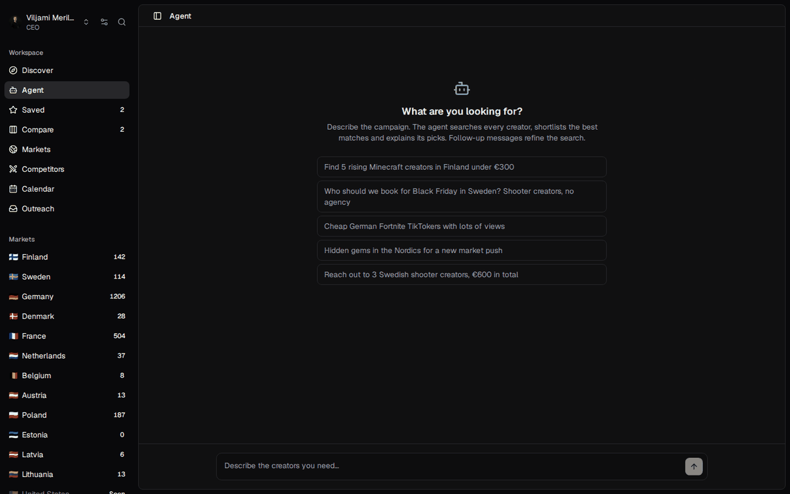
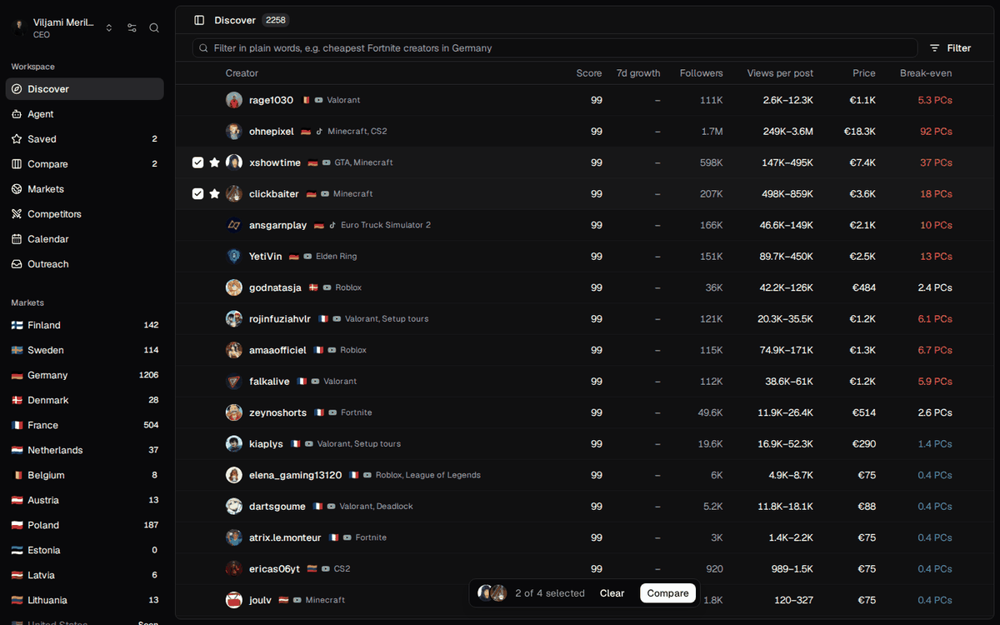
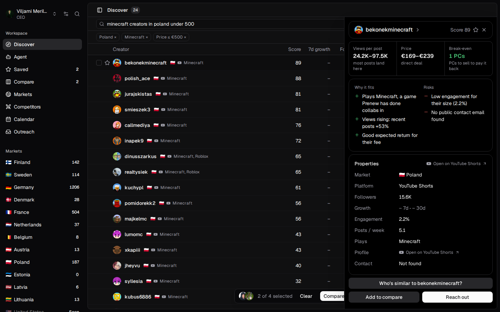
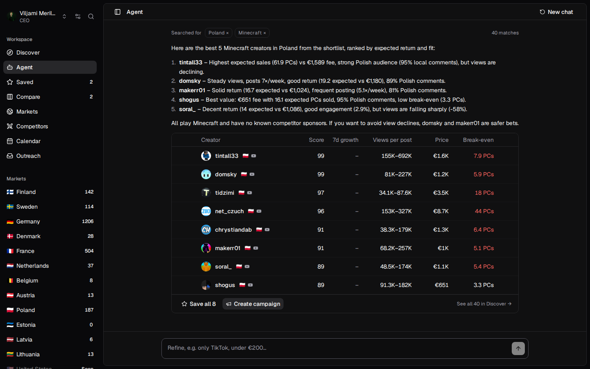
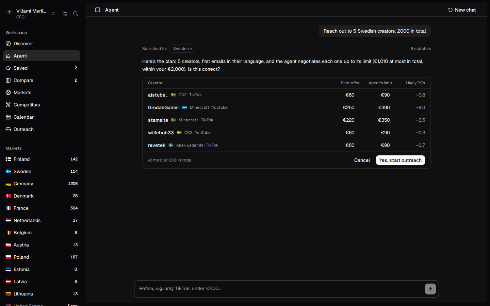
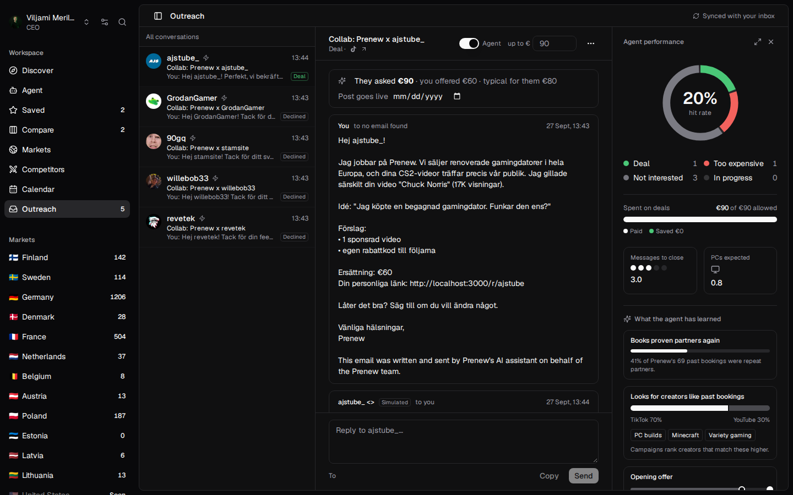
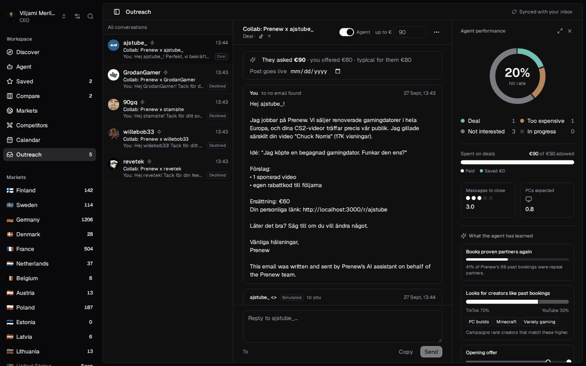
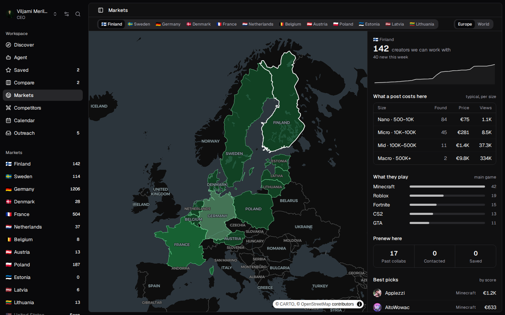
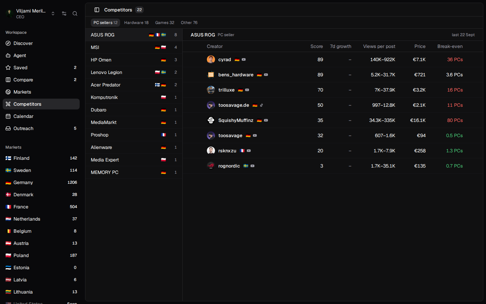

# Scout

Scout helps Prenew find gaming creators on TikTok and YouTube Shorts across Europe, figure out what a
sponsored post from them is worth, and reach out to them. You can hand the outreach to an AI agent that
writes to creators in their own language and negotiates within the budget you set.



## What you can do

- Search for creators in plain words, like "minecraft creators in poland under 500".
- See what each creator costs, how many PCs a post would likely sell, and whether they've worked with other
  PC shops before.
- Check who their audience is: how many comments are in the local language, and how many people ask about
  their PC setup.
- Ask the agent questions about creators or about your ongoing outreach.
- Start a campaign with one sentence, like "Reach out to 5 Swedish creators, €2,000 in total". You get a plan
  first and nothing is sent until you say yes.
- Follow the conversations in Outreach, and see how the agent is doing and what it has picked up so far.

|  |  |
|---|---|
|  |  |
| Searching and filtering | A creator's profile |
|  |  |
| Asking the agent | A campaign plan waiting for a yes |
|  |  |
| The agent negotiating in Swedish | Hit rate and what the agent learned |
|  |  |
| Markets | Creators who promoted other PC shops |

## Where the creators come from

We wrote our own crawler instead of buying a list. It has gone through more than 45,000 YouTube channels so
far and kept around 2,300 creators in 12 countries.

It searches in each country's language and uses YouTube's autocomplete to see what people there actually
search for. From every creator it finds, it follows the people they mention, the channels they feature and
the people commenting on their videos. Most of our creators were found that way, and a lot of them are too
small to show up in normal search.

A channel only makes it in if it posts Shorts regularly, has posted in the last two months, has its audience
in one of our markets, is about gaming, and is run by an actual person. For each creator we also read their
video descriptions for sponsors and their comments for audience language and interest in PCs.

The crawler uses the official YouTube API and stays within its limits.

## How creators are scored

The Score ranks each creator against the others in the same country. The weights come from marketing
research:

- **Fit with Prenew (25%)**: games close to PC gaming, past PC sponsors, viewers asking about PCs. Brand fit
  is the strongest predictor of how well a sponsorship works (Breves et al., University of Würzburg, 2019).
- **Audience in the country (20%)**: followers have to be people who can actually buy from Prenew (Leung et al.,
  *Journal of Marketing*, 2022).
- **Engagement (20%)**: compared only with creators of a similar size, since engagement drops as accounts
  grow (Wies, Bleier & Edeling, *Journal of Marketing*, 2023).
- **Return per euro (15%)**: expected PCs sold against their price.
- **Growth (12%)** and **posting regularly without too many ads (8%)**: audiences trust creators less when
  their feed is full of sponsored posts (Harvard Business School).

The full method is in [docs/METHODOLOGY.md](docs/METHODOLOGY.md).

## The agent

The agent never makes up numbers. Prices, limits and predictions come from our own code, and the language
model only reads and writes the messages. It always makes the first offer and keeps a friendly tone, which
negotiation research (including MIT's 2025 AI negotiation competition) shows gets more deals done.

It also learns as it goes. It looks at Prenew's past collaborations to see what kind of creators they
usually book, and at its own negotiations to see where deals end up, so it can adjust its opening offers and
who it picks next.

Every email the agent sends says it was written by Prenew's AI assistant, as the EU AI Act requires, and a
person has to approve each campaign before anything goes out.

## Running it

You need Node 24 and [uv](https://docs.astral.sh/uv/).

```bash
cd app && npm install && npx next dev --turbopack -p 3000
```

Then open http://localhost:3000. Put your keys in a `.env` file in the repo root: `FEATHERLESS_API_KEY` for
the language model, and `YOUTUBE_API_KEY` for the crawler (you can add `YOUTUBE_API_KEY_2` and so on). Without
a Featherless key it falls back to a local [Ollama](https://ollama.com) model.

To run the crawler:

```bash
uv run crawler/scout.py apisearch     # search for new channels
uv run crawler/scout.py apiqualify    # check the channels it found
uv run crawler/scout.py run --no-qualify --no-search   # everything else
uv run crawler/scout.py status        # see how it's doing
```

The app picks up new creators from the crawler automatically.

## Repo

- `app/`: the web app (Next.js, React, Tailwind)
- `crawler/`: the crawler (Python)
- `docs/METHODOLOGY.md`: how every number is calculated

The UI is based on [circle](https://github.com/ln-dev7/circle) by ln-dev7 (MIT license).
